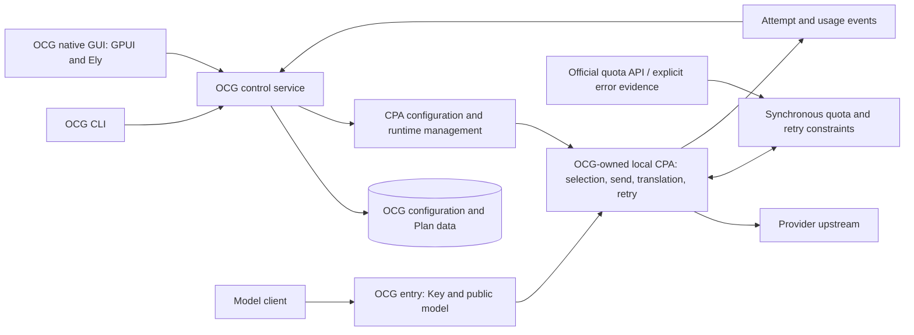

[简体中文](architecture.zh-CN.md)

# OCG3 architecture: CPA execution, CLI, and native GUI

Status: CPA design adopted on 2026-10-02; native GUI direction adopted on 2026-10-04; local-CPA-only boundary adopted on 2026-10-04. **One OCG-owned local CPA is the sole gateway execution foundation. OCG delivers a complete headless CLI first, and later the accepted native desktop GUI, together with configuration, access control, public models, and Plan capabilities.** The product identity remains Open Console Gateway. `ocg3` and `open-console-gateway` are distinct generation branches of that one project tree. This generation's command is `ocg`, its Rust package is `ocg-cli`, and its default data root is `~/.ocg3`. The product has no external CPA mode, no owned-versus-remote target selector, no remote management credential, and no separate remote CPA readiness or catalog contract. The headless CLI is the current deliverable. The native GUI remains the accepted GPUI and Ely design and is postponed until that CLI is accepted. Whole CLI acceptance is pending. Commands are in the [CLI guide](user/cli.md). The historical kernel, retained older source, and the current CPA ingress are separated in [migration boundaries](maintainer/cpa-migration.md).

## 1. Decision and product scope

OCG is a local multi-Plan gateway. An operator must be able to configure, start, connect clients, and manage it from an empty data directory using only the CLI. The desktop target uses Rust, GPUI, and Ely across Windows, Linux, and macOS; Windows is the primary development environment. The GUI provides graphical management while headless operation remains complete. There is no WebUI or WebView-based main interface. A tray is outside the adopted GUI scope.

### Product lineage and generation branches

Open Console Gateway is one product. `ocg3` and `open-console-gateway` are two generation branches of that one project tree, in the same sense that Python 3 and Python 2 are two generations of one language. This architecture is the OCG3 generation. Its owned-local-CPA execution design is not an ordinary compatible patch of the previous generation, and it is not an unrelated new project.

The user command is `ocg`: `ocg.exe` on Windows, and `ocg` on Linux and macOS. Help, errors, and examples for this generation use that command. The Rust package is `ocg-cli`, in `crates/ocg-cli`. That package name is not a second user command. There is no alias executable named `ocg-manager-cli`. Historical published names, package identifiers, and backup format tags remain historical references. Serialization tags and encryption compatibility keep their existing names.

The default CLI data root is `~/.ocg3`. A launch that does not pass a directory uses that root. It does not open, copy, move, delete, or adopt the previous generation's default profile or data, including `~/.ocg-mgr-cli`. Explicit `--data-dir` remains supported and is validated in the ordinary way. Bringing previous-generation files forward is a separate explicit migration. Existing backups stay where the operator left them.

That local CPA supplies provider connections, authentication refresh, protocol translation, streaming, and failure recovery. Private inference and management endpoints belong to the child this installation owns. Operators do not point OCG at a separate CPA product. A supported custom HTTP provider remains a provider capability, and the local CPA executes it. A custom endpoint stays a provider route. It does not become a managed CPA instance, and it does not add a second execution foundation. OCG development concentrates on Plan management, a unified entry point, precise quotas, and understandable status. Necessary CPA extensions or narrowly scoped patches are acceptable. A complete custom sending, credential traversal, and backoff loop outside the local CPA is outside the target, including any fallback to the former kernel.

Local money, credit, or token estimates do not govern quota admission, credential selection, or retries. Without trustworthy provider evidence, quota is unknown, rather than zero, unlimited, or estimated exhaustion. The migration guide covers existing estimate data; this design does not commit to further estimate-settlement machinery.

## 2. Components and responsibilities

| Responsibility | Sole owner | Boundary |
| --- | --- | --- |
| CLI and control operations | OCG | Configuration, import, mutations, start/stop, status, logs, and backups work without a UI |
| Native GUI | OCG | A client of shared control operations; presentation and interaction do not own execution, storage, quota enforcement, or retries |
| Client access Keys | OCG | Authentication, enablement, rotation, permissions, and redaction; provider credentials and CPA management secrets stay private |
| Public models and Plan configuration | OCG | Persist aliases, model scopes, priorities, enablement, and product identities; project execution configuration to CPA |
| Credential selection per attempt | CPA | Respect projected eligibility, order, and quota constraints; OCG entry does not select Keys or perform fallback |
| Provider transport and protocols | CPA | HTTP, proxies, authentication refresh, translation, streaming, cancellation, and execution results |
| Ordinary cooldown and retry | CPA | Temporary limits, transient failures, and permitted credential failover; OCG does not duplicate their counters and clocks |
| Precise quota evidence and scope | OCG | Recognize authoritative sources and normalize scopes, windows, and reset times; enforce through synchronous constraints inside CPA |
| Attempt logs and usage projections | OCG | Consume CPA events, correlate all attempts under one client request, and distinguish failure, uncertainty, and success |

The process boundary is the Rust CLI and control service plus the one CPA child that OCG owns. The native GUI, when it is built, is a separate client of that control service. Extensions run within the owned child, without another review service and without a remote CPA management client. If synchronous integration requires an SDK host or a small patch, preserve these responsibilities. This design does not prescribe new execution crates, services, or a plugin framework. Historical remote CPA settings remain stored data under the migration boundaries. They are not a second runtime in this design.

## 3. Request path

1. OCG validates the client Key, model permissions, request size, and public model identity. Unknown or ambiguous models fail before outbound traffic. Client Keys are not forwarded as provider Keys.
2. The control plane has already generated the CPA route configuration. Inference does not discover upstream models, download catalogs, or mutate saved mappings.
3. OCG hands the request to the private inference entry of its owned local CPA. That entry handles product admission, necessary model-name mapping, deadlines, and cancellation. CPA owns protocol translation. Management of the child uses the same private boundary. Clients do not receive that management credential.
4. CPA selects an eligible credential for each attempt. Synchronous integration applies precise quota deadlines and retry decisions before the CPA executor sends.
5. Quota evidence from an explicit rejection must take effect before subsequent attempts can use the affected scope. CPA continues to own ordinary cooling; these are not independent retry schedulers.
6. CPA returns a response or stream. OCG forwards it and records correlation information, without starting the original request again after downstream output begins.

OCG configuration determines eligible credentials, public models, and priorities. CPA determines the actual credential for an attempt. One public model may route to candidates from several Plans; OCG does not implement retry by traversing CPA instances itself.

## 4. Generic precise quotas

### 4.1 A shared evidence model

Provider adapters normalize facts; the shared capability stores and applies them. A restriction contains at least:

- Source, observation time, and confidence; retain raw responses only when needed and redacted.
- Provider, credential or explicitly shared account/pool identity, and credential version.
- Model scope or whole-credential scope; preserve individual quota windows.
- A declared reset time, or confirmed exhaustion with an unknown reset time.

Go official usage and explicit GOAT Plan-limit errors are the two currently known sources. Each needs its own parser; arbitrary quota prose or HTTP 429 does not create persistent Plan exhaustion. Add other provider adapters according to actual evidence. Providers without such a source remain usable.

### 4.2 Restriction scope

Default isolation follows the credential that received the evidence. Whole-Key Plan limits apply across that Key's models; model restrictions affect only the evidenced model scope. Shared account or pool quota requires an authoritative relationship or explicit operator declaration, never inference from names, URLs, or Key prefixes.

Plans, credentials, and pools have persistent OCG identities independent of display names and catalog order. CPA's selected AuthID maps to that identity and credential version. Synchronous results carry the same attempt identity rather than writing an earlier result onto a replacement Key. Declared sharing does not expand model scope. A reset timestamp proves a restriction deadline, not exact remaining quota or balance.

An attempt must satisfy every applicable window. Precise deadlines and CPA ordinary cooldown jointly determine admission. Updating one window does not clear another or expand ordinary 429 into shared quota exhaustion.

Conflicting valid deadlines for the same version, scope, and window retain the later restriction. Only new authoritative healthy evidence for that scope, natural expiry, or identity invalidation clears it. Anomalous sources or weaker observations cannot shorten an existing authoritative restriction.

Skip a restricted scope before its reset. Real requests may retry after expiry; there is no unconditional background inference probe. Confirmed exhaustion with an unknown reset gets controlled recovery opportunities within CPA's recovery path. Their interval is an implementation policy, not an inherited 15-minute, one-hour, six-hour ladder.

Network failures and recovery timeouts prove neither renewed exhaustion nor healthy quota. Rotation, deletion, or rebinding invalidates old-version evidence; late results cannot resurrect it. Valid known deadlines survive restart.

### 4.3 Enforcement location

Apply precise restrictions inside CPA at per-attempt selection and sending boundaries. Synchronous result processing records confirmed restrictions before subsequent attempts can use that scope. Already in-flight requests cannot retrospectively be guaranteed unsent; the guarantee covers new attempts after enforcement takes effect.

Asynchronous usage and completion callbacks serve logging, presentation, and reconciliation. They alone cannot provide strict admission: the experiment demonstrated cross-model reuse before delayed observation. Missing mandatory plugins, invalid decisions, or unreadable required state must report the route unavailable rather than silently bypass promised precise restrictions.

## 5. Retry and ordinary backoff

| Execution fact | New-version decision |
| --- | --- |
| Local authentication, parameter, or model validation fails | No send or credential retry |
| Explicit recoverable limit or quota rejection | Record the affected restriction; CPA may select another eligible credential |
| Provider confirms no execution occurred | CPA may recover within the request budget; HTTP status alone does not establish this |
| Upstream may have received the request but its result was lost | Do not replay the same generation automatically; return an explicit error and preserve uncertain-result attribution |
| Downstream output has started | Terminate a failed stream without regenerating through another credential |
| Caller cancels or the total deadline expires | Cancel upstream and subsequent attempts; do not finish or replay the request in the background |

Explicit 429 failover and uncertain-result no-replay must work together. A blanket ban on second attempts is an experimental control, not the full product policy. CPA's execution path owns attempt, waiting, and deadline budgets. OCG does not issue the same generation again from an outer loop.

Use CPA's existing mechanisms and configuration for ordinary cooling. Do not migrate OCG's old generic rules engine, layered recovery registry, and independent fallback loop. Necessary provider-specific scope constraints belong in narrow evidence adapters, without rebuilding a general scheduling framework.

## 6. Configuration, credentials, and state

OCG product configuration and Plan facts remain in existing local storage. Generated configuration for the owned local CPA is a rebuildable projection, not a second independently editable product configuration. Track the configuration version applied to that child. If a product mutation is saved but application fails, distinguish desired from effective configuration, report failure, and retain the previous valid configuration rather than claiming success.

Product configuration has no remote CPA base URL and no remote management credential. A historical remote row that is still stored is migration input. Starting or saving the owned local runtime does not rewrite that row into an owned-native credential, open a connection to it, or delete it. Moving it onto the local runtime requires an explicit migration.

The default data root is `~/.ocg3`. The process does not treat `~/.ocg-mgr-cli` or any other previous-generation default as its own data. Backup and restore apply to the directory the operator selected. Previous-generation files move only through an explicit migration, and existing backups stay the operator's copies.

OCG owns imported API Keys and supplies execution projections to CPA. CPA owns OAuth login results and refresh state; OCG retains references and necessary redacted status. Secret files have private directory permissions and do not enter logs, command history, the repository, or plaintext exports. Backup and restore account for OCG configuration/encryption identity and CPA-owned authentication state.

Treat configuration, quota evidence, CPA execution state, and observation projections separately. Control mutations retain the current V4 HTTP and CAS contract. CLI and GUI invoke shared operations instead of opening another database to mutate a running service. Version and lifecycle checks prevent stale observations from overwriting rotation, deletion, or newer configuration.

Retain `/dashboard/api/v4` as the CLI and GUI control prefix for now; its name does not require a web Dashboard. This document adds no REST version and exposes no arbitrary proxy to CPA's raw management API. Actual HTTP/schema changes require implementation and corresponding documentation.

## 7. Runtime and security

- Clients access OCG. Inference and management for the owned local CPA use private connections, so a client cannot bypass OCG Key and model-scope checks and cannot call CPA management directly.
- The owned child listens on loopback. URL validation, authentication, and proxy boundaries stay in force. The target does not add a selector that sends management or inference to a remote CPA, including a fixed Docker hostname.
- OCG starts, monitors, and stops only the CPA process it owns. It does not terminate unrelated processes and does not share their writable auth directory.
- Startup confirms the owned CPA version, applied configuration, and required extensions. If the child fails, the gateway reports unavailable. It does not fall back to the former kernel and does not replay in-flight requests.
- Installation and upgrades use an identified CPA version and verification source. An experimental version is not a permanent support promise. Failed upgrades can restore runtime files and compatible configuration; storage changes still follow backup/restore rules.
- Errors, cancellation, exit, and restart release owned connections, processes, and resources. Correlate client requests and upstream attempts while redacting provider and management secrets.

## 8. Complete CLI acceptance

The CLI must deliver a complete gateway independently of the GUI. Without an interface, an operator can:

1. Initialize an empty directory, prepare the OCG-owned local CPA, start it, and inspect health.
2. Configure providers, Plans, API/OAuth credentials, proxies, model scopes, aliases, priorities, and enablement.
3. Create, rotate, and disable client Keys, obtain connection details, and send inference.
4. Read or refresh supported authoritative quota and explain evidence, affected scopes, and recovery times; present unknown values explicitly.
5. Inspect successful and failed attempts, reported token usage, and uncertain results; preserve declared deadlines through restart and handle cancellation/stream failure as above.
6. Mutate live configuration with clear save/application outcomes, back up, restore, and stop normally.

The CLI also reports configuration errors, login/import/revocation outcomes, and nonzero failure exit codes. Health distinguishes process existence from readiness of the owned local CPA. A retained historical remote setting is not readiness and does not open a connection. Restart after a crash restores valid configuration and deadlines without replaying earlier uncertain requests.

The user command is `ocg`. `serve`, `api`, and `schema` are subcommands of that command. Names follow `--help` and the published schemas. See the [CLI guide](user/cli.md). Provider functions that CPA or an adapter does not supply remain explicit migration gaps.

## 9. Native desktop GUI

### 9.1 Framework and service boundary

Use [Ely-GPUI-Components](https://github.com/ZacharyZhang-NY/Ely-GPUI-Components) for components and [GPUI](https://gpui.rs/) for native windowing, layout, input, and drawing. Ely's browser gallery is a WebAssembly preview, not OCG's delivery surface. The desktop interface renders directly through GPUI. This design introduces no Vue/Tauri frontend, browser shell, or required embedded webpage.

The GUI uses OCG's existing V4 control contract and authentication rules. It neither edits SQLite or CPA projections directly nor accesses the private management endpoint of the owned local CPA. The control service owns configuration, encryption, authoritative evidence, and that one CPA process. Closing the GUI leaves the gateway running; **Stop gateway** is an explicit service operation. Exit, cancellation, and disconnect release GUI-owned resources without killing unrelated processes.

First launch offers initialization of an OCG-owned local service or attachment to an existing local OCG control service on the same machine. Attachment is a connection to that OCG host. It is not a connection to an external CPA product. A native launcher may start the OCG host; that host alone opens the data directory and manages the owned local CPA. The GUI completes onboarding and establishes management authorization through shared operations. Missing, incompatible, uninitialized, and unavailable services have explicit recovery actions. After a service restart, reconnect and obtain fresh process-generation/revision tokens before another mutation. Bootstrap, authorization handoff, and recovery belong to the postponed GUI.

### 9.2 Adopted layouts and navigation

- **A — Light overview, the home page.** Show local gateway readiness, Plan status, items needing attention, client connection details, and recent requests. Use spacious rows, quiet light surfaces, thin dividers, and color for meaning. Keep setup and recovery actions close to the affected state. [Concept A](../design/gui-concepts/2026-10-04/a-light-overview.png).
- **C — Plan center, the Plan page.** Select a Plan from the left list; inspect quota windows, reset times, evidence, linked accounts, and model scope on the right. Distinguish short and long windows instead of collapsing them into one total. [Concept C](../design/gui-concepts/2026-10-04/c-plan-center.png).
- **B — Management workbench, an optional compact mode.** A dense table and persistent details panel support bulk selection, filters, and frequent management. Preserve it as a later density/layout option, not another required application or first-release prerequisite. [Concept B](../design/gui-concepts/2026-10-04/b-dark-workbench.png).

Navigation covers Overview, Plans, Accounts, Models, Keys, Logs, and Settings. Accounts handle API-key/import/OAuth onboarding and redacted connection status; Models handle public names, aliases, scopes, and refresh; Keys handle client permissions, creation, rotation, and disablement. Logs distinguish client requests from upstream attempts and preserve uncertain outcomes. Settings covers local configuration, proxies, the owned local runtime, and backup/restore. It does not add a remote CPA connection form. Necessary client and application capabilities, and supported custom HTTP providers, remain subject to the migration map. Omission from a mockup does not retire them.

All three images are visual concepts with synthetic data, not GPUI screenshots or implemented capability evidence. Chinese copy in the images does not fix product languages. Provider names, model names, example ports, quota percentages, reset times, and status labels do not define APIs or provider support. In particular, the images' “console connected” wording means connection to the local management service; it does not add a web console. Implementation uses one consistent set of component, spacing, typography, theme, and focus rules; the drawings need not be reproduced pixel for pixel.

### 9.3 Evidence and interaction

Quota presentation follows section 4: show only values supported by authoritative evidence, with source, freshness, identity/version, credential/model/pool scope, window, and reset time available in details. A known restriction deadline does not prove remaining quota. Missing evidence stays unknown; neither an ordinary 429 nor an account's connectivity supplies a precise percentage. Show stale or failed refresh separately from confirmed exhaustion. Do not sum unrelated Plans or windows into a precise total, predict exhaustion from local estimates, or give the GUI its own admission/recovery clock.

Long lists and logs need bounded loading and appropriate virtualization. Network, disk, and process work must not block the UI thread. Keyboard navigation, visible focus, accessible names, non-color status labels, text selection/copy, and readable scaling are acceptance requirements. Optional animation respects reduced motion.

Freeze the selected identity/version for each async operation and reject stale results after navigation, rotation, deletion, or reconnect. Preserve edits on a CAS conflict and offer reload/reconciliation rather than silent overwrite. A primary save receipt ends the save operation; a later projection/reload failure is a separate result. Distinguish saved configuration, failed application to CPA, and an unknown write outcome after connection loss. Do not automatically repeat a destructive or outcome-unknown write. Secrets remain redacted except in deliberate, authorized reveal/copy flows and never enter logs or screenshots of real credentials.

Full backup/restore is a shared control/lifecycle gap. The current CLI procedure stops `serve` and copies its data directory; V4 does not thereby provide a complete online backup operation. The future GUI workflow must coordinate quiescence, OCG configuration/database/encryption identity, CPA authentication state, compatible restore, failure recovery, and reconnect through shared lifecycle operations. The GUI must not acquire its own database ownership to fill this gap.

### 9.4 Platforms and verification

Design for Windows, Linux, and macOS from the start. Share pages and business behavior; isolate data paths, shortcuts, window/menu behavior, file/clipboard integration, and process launch differences in small platform adapters. Select each platform's GPUI backends, including Linux X11/Wayland, explicitly. CPU architectures, minimum OS versions, Linux distribution support, and packaging formats require a published support matrix based on verification; the three-system target alone does not establish it.

As checked on 2026-10-04, Ely's [README](https://github.com/ZacharyZhang-NY/Ely-GPUI-Components#build-notes) reports macOS-only testing. Its manifest requires Rust 1.95 and pins GPUI to a Zed revision. Pin Ely and its matching GPUI dependencies together and recheck these facts when implementing. Platform-specific components must be verified or adapted before use. Missing development hardware does not remove a platform from the design target.

Use native CI for each OS's compile/link and business tests. Add startup, connection/reconnection, layout, input, and shutdown checks in suitable graphical environments; separately check packaged installation and launch. Windows local interaction and Linux/macOS native CI, remote environments, or tester feedback supply different evidence. Compilation, an opened window, automated interaction, package validation, and actual IME/focus/multi-display/GPU behavior are recorded separately. Lack of real interaction evidence remains explicit rather than becoming a claim of confirmed support.

### 9.5 Implementation and acceptance

Current implementation priority is the complete headless CLI acceptance in section 8, on the one owned local CPA, including shared lifecycle, backup/restore, and execution guarantees. GUI implementation is postponed until that acceptance is actually met. The GPUI and Ely layouts, navigation, evidence rules, and platform rules in this section stay adopted. After the CLI acceptance, start with a three-platform native sample containing the shared shell, Plan list/details, a Chinese input form, quota states, and updating logs. It verifies framework and platform suitability. It is a checkpoint, not the complete GUI deliverable. Continue with the full management workflows above and clearly mark any unavailable capability.

End-to-end acceptance starts from an empty data directory: initialize/attach and authorize; add an API-key or OAuth account; configure a Plan and public model; create a scoped client Key and copy connection details; start and confirm gateway readiness; inspect quota evidence and request/attempt logs; edit with save/application/conflict feedback; back up and restore with recovery; explicitly stop the gateway. Cover service restart, unavailable service, cancellation, stale responses, and unknown write outcomes. Closing the window while inference runs must not stop the gateway. Validate keyboard/focus/accessibility/scaling on each supported native platform, and retain the independent CLI acceptance in section 8.

## 10. Design and implementation status

The owned local CPA foundation, the Open Console Gateway lineage, the `ocg` command, the `ocg-cli` package, the `~/.ocg3` default, and the native GPUI/Ely GUI direction are decided. The product has one local CPA and no external CPA product mode. Synchronous precise quotas, selective no-replay, explicit migration of historical remote settings and of previous-generation data, retirement of retained older execution code, the postponed GUI and its bootstrap and recovery, full shared backup and restore, and native platform acceptance remain open. Whole CLI acceptance is pending. This page is the design. It is not a runtime acceptance record and it is not a publication. Completed experiments and their limits are in [CPA validation findings](maintainer/cpa-validation.md). The source layers are in [migration boundaries](maintainer/cpa-migration.md).
