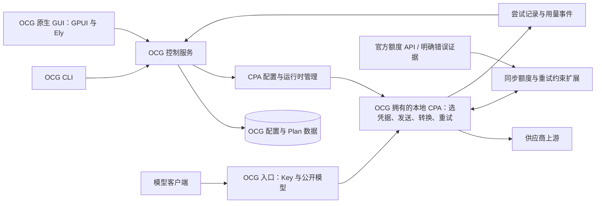

[English](architecture.md)

# OCG3 架构：CPA 执行底座、CLI 与原生 GUI

状态：2026-10-02 确定 CPA 设计，2026-10-04 确定原生 GUI 方向，同日确定只使用本地 CPA 的产品边界。**OCG 拥有的一个本地 CPA 是唯一的网关执行底座。OCG 先交付完整的无界面 CLI，其后才是已确定的原生桌面 GUI，并同时提供配置、访问控制、模型发布与 Plan 能力。** 产品身份仍是 Open Console Gateway。`ocg3` 与 `open-console-gateway` 是这一棵项目树里彼此分开的代际分支。这一代的命令是 `ocg`，Rust 包是 `ocg-cli`，默认数据根是 `~/.ocg3`。产品没有外部 CPA 模式，没有“自有 / 远端”目标选择器，没有远端管理凭据，也没有单独的远端 CPA 就绪或目录合约。无界面 CLI 是当前交付物。原生 GUI 仍是已接受的 GPUI 与 Ely 设计，推迟到该 CLI 被验收之后。完整 CLI 验收尚未完成。命令见 [CLI 指南](user/cli.zh-CN.md)。历史内核、保留的旧源码和当前 CPA 入口的区分见 [迁移边界](maintainer/cpa-migration.zh-CN.md)。

## 1. 决策与产品范围

OCG 是本地多 Plan 网关。操作者必须能够只用 CLI，从空数据目录完成配置、启动、接入客户端和日常管理。桌面目标采用 Rust、GPUI 与 Ely，覆盖 Windows、Linux、macOS；Windows 为主要开发环境。GUI 提供图形化管理，无界面运行仍须完整可用。不采用 WebUI 或基于 WebView 的主界面。托盘不在本次确定的 GUI 范围内。

### 产品谱系与代际分支

Open Console Gateway 是同一个产品。`ocg3` 与 `open-console-gateway` 是这一棵项目树的两个代际分支，如同 Python 3 与 Python 2 是同一种语言的两代。本文是 OCG3 这一代。它以自有本地 CPA 为执行底座的设计，不是对上一代的普通兼容补丁，也不是一个无关的新项目。

用户命令是 `ocg`：Windows 上为 `ocg.exe`，Linux 与 macOS 上为 `ocg`。这一代的帮助、错误和示例都使用该命令。Rust 包是 `ocg-cli`，位于 `crates/ocg-cli`。包名不是第二条用户命令。没有名为 `ocg-manager-cli` 的别名可执行文件。历史上已发布的名称、包标识和备份格式标签仍是历史引用。序列化标签和加密兼容性保持现有名称。

默认 CLI 数据根是 `~/.ocg3`。未传入目录的启动使用该根。它不打开、不复制、不移动、不删除、也不接管上一代的默认配置与数据，包括 `~/.ocg-mgr-cli`。显式 `--data-dir` 仍然支持，并按原有方式校验。把上一代文件带入新目录是单独的显式迁移。已有备份留在操作者原来存放的位置。

这个本地 CPA 负责供应商连接、认证刷新、协议转换、流式处理和故障恢复。私有推理入口和管理入口都属于本安装拥有的子进程。操作者不把 OCG 指向另一个 CPA 产品。受支持的自定义 HTTP 供应商仍是供应商能力，由本地 CPA 执行。自定义端点仍是供应商路由，不会变成受管的 CPA 实例，也不会增加第二套执行底座。OCG 的开发集中在多 Plan 管理、统一入口、精确额度和可解释的状态上。允许维护必要的 CPA 扩展或小范围补丁。在本地 CPA 之外再做一整套自研发送、凭据轮询和退避循环不属于目标，其中也包括回退到旧内核。

本地金额、积分或 token 估算不参与额度准入、凭据选择和重试决策。厂商未提供可信限额时，额度是未知，而不是零、无限或“估算已耗尽”。既有估算数据的迁移见迁移文档；本设计不承诺继续建设估算结算引擎。

## 2. 组件与责任

| 责任 | 唯一所有者 | 边界 |
| --- | --- | --- |
| CLI 与控制面操作 | OCG | 配置、导入、增删改、启动/停止、状态、日志、备份均可无界面完成 |
| 原生 GUI | OCG | 共享控制操作的客户端；展示和交互不拥有执行、存储、额度准入或重试 |
| 客户端访问 Key | OCG | 鉴权、启停、轮换、权限、脱敏；不能向客户端暴露供应商凭据或 CPA 管理密钥 |
| 公开模型与 Plan 配置 | OCG | 持久化别名、模型范围、优先顺序、启停和产品身份；向 CPA 投影执行配置 |
| 每次尝试选择凭据 | CPA | 遵守 OCG 投影的候选范围、顺序与额度约束；OCG 入口不再自行选 Key 或 fallback |
| 上游连接与协议处理 | CPA | HTTP、代理、认证刷新、协议转换、流式响应、取消和执行结果 |
| 普通冷却与重试 | CPA | 临时限流、短时故障和允许的换凭据；OCG 不另存同一套计数与时钟 |
| 精确额度证据与范围 | OCG | 识别权威来源，归一化额度范围、窗口和恢复时间；通过 CPA 内部同步约束参与准入 |
| 执行日志与用量投影 | OCG | 消费 CPA 尝试事件，关联一次客户端请求下的所有尝试，保留失败、未知与成功的区别 |

进程边界是 Rust CLI、控制服务，以及 OCG 拥有的那一个 CPA 子进程。原生 GUI 在实现之后是该控制服务的独立客户端。扩展运行在这个自有子进程内，不另设审查服务，也不另设远端 CPA 管理客户端。如果同步扩展需要 SDK 宿主或小补丁，保持上述责任划分。本设计不固定新的执行 crate、服务或插件框架。历史上的远端 CPA 设置仍是迁移边界中的存储数据，在本设计里不是第二个运行时。

## 3. 一次请求的路径

1. OCG 校验客户端 Key、模型权限、请求大小和公开模型身份。未知或歧义模型在出站前失败。客户端 Key 不作为供应商 Key 继续传递。
2. 公开模型对应的 CPA 路由配置已经由控制面生成。请求期间不发现上游模型，不下载目录，也不改动持久化映射。
3. OCG 将请求交给自有本地 CPA 的私有推理入口。入口做产品准入、必要的模型名称映射、超时与取消传递。协议转换交给 CPA。对子进程的管理使用同一条私有边界。客户端拿不到该管理凭据。
4. CPA 在每次尝试中选择合格凭据。同步扩展应用精确额度截止时间与重试决策，随后由 CPA 的执行器发送。
5. 明确拒绝产生的额度证据必须在后续尝试准入前生效。普通冷却继续由 CPA 更新；两者不是两套各自重试的调度器。
6. CPA 返回响应或流。OCG 转发执行结果并记录关联信息，不在下游响应已经开始后重新发起原请求。

OCG 配置只定义“可选哪些凭据、公开什么模型、按什么优先顺序”。CPA 决定“这一次实际使用谁”。同一公开模型可以指向多个 Plan 的候选配置；不会通过 OCG 外层轮询 CPA 实例来实现重试。

## 4. 通用精确额度能力

### 4.1 统一的是证据模型

供应商适配代码归一化事实，通用能力保存和应用事实。每条额度限制至少表达：

- 来源、观测时间和可信程度；原始响应仅在必要且经过脱敏时保留。
- 供应商、凭据或明确共享的账号/额度池身份，以及凭据版本。
- 模型范围或整个凭据范围；不同额度窗口各自保存。
- 明确恢复时间，或“确认耗尽但恢复时间未知”。

Go 官方用量与 GOAT 明确的 Plan 限额错误是当前已知的两类来源。它们有各自的解析器；不能因为某个错误含有“额度”“429”就创建持久化 Plan 限制。其他厂商按实际证据增加适配；没有来源也能正常使用网关。

### 4.2 限制范围

默认按实际收到证据的凭据隔离。整个 Key 的 Plan 限额对该 Key 下的其他模型同样生效；模型级限制仅影响明确的模型范围。多个 Key 共享账号或额度池，必须有权威关系或操作者明确声明，不能按名称、URL 或 Key 前缀猜测。

Plan、凭据与额度池使用 OCG 持久化身份，不以展示名或目录顺序作为身份。CPA 实际选中的 AuthID 必须映射到该身份及凭据版本；同步结果携带同一尝试的身份，不能把较早请求的结果写入后来替换的 Key。声明了共享关系也不自动扩大模型范围。恢复时间证明的是禁用截止时间，不证明精确剩余额度或余额。

同一范围同时存在多个窗口时，尝试必须满足全部有效限制；已知截止时间与 CPA 普通冷却一起构成准入条件。更新一个窗口不会清除其他窗口，也不会把普通 429 扩散成共享额度耗尽。

同一版本、范围与窗口出现有效截止时间冲突时保留较晚的限制；只有对应范围的新权威健康证据、窗口自然到期或身份失效才解除旧限制。来源异常或较弱的观察不能缩短已有权威限制。

恢复时间尚未到达时跳过该范围。到期后由真实请求重新尝试，不进行无条件后台推理探测。确认耗尽但时间未知时，在 CPA 的恢复路径内提供受控试探机会；具体间隔属于实现策略，本文不继承旧的 15 分钟、1 小时、6 小时阶梯。

网络故障和试探超时不能证明额度再次耗尽，也不能证明额度健康。凭据轮换、删除或绑定改变后，旧版本证据不再约束新凭据；迟到结果不能恢复旧限制。重启仍保留有效的已知截止时间。

### 4.3 生效位置

精确限制在 CPA 内部、每次尝试选择和发送的边界应用。同步结果处理必须先记录已确认限制，再允许后续尝试使用相关凭据。已经在途的请求不能被事后保证“从未发送”；保证针对限制生效后的新尝试。

异步 usage 或请求完成回调用于日志、展示和核对，不独立承担严格额度准入。实验已证实异步记录会留下跨模型复用空窗。插件不可用、返回非法决策或必需状态无法读取时，不能悄悄绕过承诺的精确限制继续运行；必须明确报告该路由不可用。

## 5. 重试策略与普通退避

| 执行事实 | 新版本决策 |
| --- | --- |
| 本地鉴权、参数或模型校验失败 | 不发送，不换凭据重试 |
| 明确的可恢复限流/额度拒绝 | 记录对应范围的限制；CPA 可以换到另一合格凭据 |
| 厂商确认请求没有执行 | 在请求预算内允许 CPA 恢复；不能只由 HTTP 状态码推断 |
| 上游可能已经接收，但结果丢失 | 不自动重放同一个生成请求；返回明确错误，保留结果未知的日志状态 |
| 已开始向客户端输出 | 流失败时终止当前响应，不用另一凭据重新生成 |
| 调用者取消或总期限到达 | 取消上游及后续尝试，不继续后台完成或重放原请求 |

明确 429 的正常换 Key 与结果未知时禁止重放必须同时成立。“禁止一切第二次尝试”是实验用限制，不是完整产品策略。请求次数、等待与总期限由 CPA 执行路径统一约束；OCG 外层不会再次执行同一生成请求。

普通冷却优先采用 CPA 的现有机制和配置。OCG 不迁移旧通用规则引擎、多层资源恢复注册表与独立 fallback 循环。实际产品必须保留的特殊范围约束可以进入窄的证据适配，不据此恢复一个通用调度框架。

## 6. 配置、凭据与状态

OCG 业务配置和 Plan 事实保存在既有本地存储中。向自有本地 CPA 生成的配置是可重建投影，不能成为第二份可任意编辑的产品配置。每次应用到该子进程的配置都记录对应版本。产品变更已保存但应用失败时，区分“期望配置”和“已生效配置”，报告失败并保留上一份有效配置，不伪报成功。

产品配置不含远端 CPA 基址，也不含远端管理凭据。仍保存在存储中的历史远端行是迁移输入。启动或保存自有本地运行时，不会把该行改写成自有原生凭据，不会对它发起连接，也不会删除它。把它迁到本地运行时需要显式迁移。

默认数据根是 `~/.ocg3`。进程不把 `~/.ocg-mgr-cli` 或其他上一代默认目录当作自己的数据。备份与恢复针对操作者选定的目录。上一代文件只通过显式迁移搬动，已有备份仍是操作者自己的副本。

OCG 管理导入的 API Key，CPA 接收执行所需的运行时投影；OAuth 登录结果及刷新状态由 CPA 拥有，OCG 保存引用和必要的脱敏状态。具体秘密文件遵守私有目录权限，不进入日志、命令行历史、仓库或导出明文。备份与恢复需要同时考虑 OCG 配置/加密身份和 CPA 自有认证状态。

配置、额度证据、CPA 执行状态和观察投影分开处理。控制面变更继续使用当前 V4 HTTP 与 CAS 约定；CLI 与 GUI 调用共享业务操作，不直接打开第二份数据库来修改运行中的服务。保留版本/生命周期校验，阻止迟到观测覆盖轮换、删除和新配置。

当前接口前缀 `/dashboard/api/v4` 暂时保留作为 CLI 与 GUI 控制面；名字不要求存在 Web Dashboard。本文不新增 REST 版本，也不开放 CPA 原始管理 API 的任意代理。既有 HTTP/schema 合约的实际变更需要单独实现和同步文档。

## 7. 运行时与安全边界

- 客户端只访问 OCG。自有本地 CPA 的推理和管理使用私有连接，客户端不能绕过 OCG 的 Key 与模型范围检查，也不能直接调用 CPA 管理入口。
- 自有子进程监听回环地址。地址校验、认证和代理边界继续有效。目标不增加把管理或推理发往远端 CPA 的选择器，固定的 Docker 主机名也在此列。
- OCG 只启动、监控并停止自己拥有的 CPA 进程。不结束无关进程，也不与它们共用可写的认证目录。
- 启动必须确认自有 CPA 的版本、已应用配置和必需扩展。子进程失败时网关报告不可用。不回退到旧内核，也不重放在途请求。
- 安装和升级使用确定的 CPA 版本与校验来源；不会把运行测试的版本当作永久支持承诺。更新失败可以恢复原运行文件和兼容配置，存储升级仍按备份/恢复规则处理。
- 错误、取消、正常退出和重启均释放自有连接、进程和资源。日志关联客户端请求与每个上游尝试，供应商秘密与管理秘密始终脱敏。

## 8. CLI 完整性的完成条件

CLI 必须独立于 GUI 提供功能完整的网关。操作者无需界面即可：

1. 在空目录初始化配置，准备 OCG 拥有的本地 CPA，启动并读取健康状态。
2. 配置供应商、Plan、API/OAuth 凭据、代理、模型范围、别名、优先顺序和启停。
3. 创建、轮换、禁用客户端 Key，读取连接信息并向网关发送请求。
4. 读取或刷新厂商支持的权威额度，解释当前限制来源、影响范围和恢复时间；未知值明确显示未知。
5. 查看失败与成功尝试、实际 token 用量和结果未知状态；已知截止时间、重启、取消与流式错误按上述约定处理。
6. 修改运行中的配置，明确得到保存与应用结果，完成备份、恢复及正常停止。

CLI 还应明确报告配置错误、登录/导入/撤销结果和失败退出码。健康状态区分“进程存在”和“自有本地 CPA 已就绪”。保留的历史远端设置不算就绪，也不会因此打开连接。崩溃后的重新启动恢复有效配置与截止时间，不自动重放之前的未知请求。

用户命令是 `ocg`。`serve`、`api` 和 `schema` 是该命令的子命令。名称以 `--help` 和已发布的 schema 为准。见 [CLI 指南](user/cli.zh-CN.md)。CPA 或适配器尚未提供的供应商功能仍是明确的迁移缺口。

## 9. 原生桌面 GUI

### 9.1 框架与服务边界

采用 [Ely-GPUI-Components](https://github.com/ZacharyZhang-NY/Ely-GPUI-Components) 提供组件，[GPUI](https://gpui.rs/) 负责原生窗口、布局、输入与绘制。Ely 的浏览器 Gallery 是 WebAssembly 预览，不是 OCG 的交付界面；桌面主界面直接由 GPUI 绘制。本设计不引入 Vue/Tauri 前端、浏览器壳或必需的内嵌网页。

GUI 使用 OCG 现有 V4 控制合约与鉴权规则，不直接修改 SQLite 或 CPA 投影，也不访问自有本地 CPA 的私有管理入口。控制服务拥有配置、加密、权威证据和这一个 CPA 进程。关闭 GUI 后网关继续运行；**停止网关**是显式服务操作。退出、取消和断连释放 GUI 自有资源，不结束无关进程。

首次启动提供初始化 OCG 自有本地服务，或附着到同一台机器上已经运行的本地 OCG 控制服务。附着连接的是该 OCG 宿主，不是外部 CPA 产品。原生启动适配可以启动 OCG 宿主；仅该宿主打开数据目录并管理自有本地 CPA。GUI 通过共享操作完成初始化和管理授权。服务缺失、版本不兼容、尚未初始化和暂时不可用均有明确恢复操作。服务重启后先重连、取得新的进程代际与 revision，再提交变更。启动引导、授权交接和恢复属于推迟中的 GUI。

### 9.2 已确定的布局与导航

- **A — 轻盈概览，作为首页。** 展示本地网关就绪状态、Plan 状态、待处理事项、客户端连接信息与最近请求。使用宽松行布局、安静浅色、细分隔线和有意义的状态色；初始化与恢复操作靠近对应状态。[设计图 A](../design/gui-concepts/2026-10-04/a-light-overview.png)。
- **C — Plan 中心，作为 Plan 页面。** 左侧列表选择 Plan，右侧查看额度窗口、恢复时间、证据、关联账号和模型范围；短周期和长周期窗口分别展示，不合并成一个总量。[设计图 C](../design/gui-concepts/2026-10-04/c-plan-center.png)。
- **B — 管理工作台，作为可选紧凑模式。** 密集表格与固定详情面板支持批量选择、筛选和频繁管理。保留为后续密度/布局选项，不另做一个应用，也不作为首次交付前提。[设计图 B](../design/gui-concepts/2026-10-04/b-dark-workbench.png)。

导航覆盖总览、Plans、账号、模型、Keys、日志和设置。账号承担 API Key/导入/OAuth 接入和脱敏连接状态；模型承担公开名称、别名、范围和刷新；Keys 承担客户端权限、创建、轮换与停用。日志区分客户端请求与上游尝试，保留结果未知状态。设置覆盖本地配置、代理、自有本地运行时和备份恢复，不增加远端 CPA 连接表单。必要的客户端与应用接入能力，以及受支持的自定义 HTTP 供应商，仍按迁移映射保留。设计图没有画出，不构成这些能力的退出。

三张图均为使用合成数据的视觉概念，不是 GPUI 截图或已实现能力的证据。图中中文文案不固定产品语言范围。供应商名、模型名、示例端口、额度百分比、恢复时间和状态文案不定义 API 或厂商支持范围。图中的“控制台已连接”仅指连接本地管理服务，不新增 Web 控制台。实施时使用一致的组件、间距、字体、主题与焦点规则，不要求逐像素复刻图片。

### 9.3 证据与交互

额度展示遵守第 4 节：只显示权威证据支持的数值，详情可查来源、新鲜度、身份/版本、凭据/模型/池范围、窗口和恢复时间。已知限制截止时间不证明剩余额度。没有证据时保持未知；普通 429 或账号连通状态不能提供精确百分比。陈旧数据、刷新失败与确认耗尽分别展示。不同 Plan 或窗口不相加成精确总量，不用本地估算预测耗尽，也不给 GUI 增加自己的准入/恢复时钟。

长列表和日志采用有界加载与适当虚拟化；网络、磁盘和进程工作不得阻塞 UI 线程。键盘导航、可见焦点、无障碍名称、非纯颜色的状态文案、文本选择/复制和可读缩放属于验收要求。可选动画遵守减少动态效果设置。

每次异步操作固定所选身份/版本，导航、轮换、删除或重连后拒绝迟到结果。CAS 冲突时保留草稿，提供重载/核对，不静默覆盖。主保存回执结束保存操作；后续投影/重载失败单独呈现。区分配置已保存、CPA 应用失败和断连后的写入结果未知，不自动重复破坏性或结果未知的写入。秘密默认脱敏，仅在明确授权的主动查看/复制流程中显示；不进入日志或真实凭据截图。

完整备份恢复属于共享控制/生命周期缺口。现有 CLI 流程是停止 `serve` 后复制数据目录，不代表 V4 已提供完整在线备份操作。未来 GUI 流程须通过共享生命周期操作协调静止状态、OCG 配置/数据库/加密身份、CPA 认证状态、兼容恢复、失败恢复和重连；不能为补齐该缺口而让 GUI 获得独立数据库所有权。

### 9.4 平台与验证

从开始就按 Windows、Linux、macOS 设计。页面和业务行为共享；数据路径、快捷键、窗口/菜单行为、文件/剪贴板接入和进程启动差异集中在小型平台适配中。显式选择各平台 GPUI 后端，包括 Linux X11/Wayland。CPU 架构、最低系统版本、Linux 发行版范围和打包格式须按验证结果列入公开支持矩阵；三个系统的目标本身不证明这些范围已支持。

截至 2026-10-04 核查，Ely 的 [README](https://github.com/ZacharyZhang-NY/Ely-GPUI-Components#build-notes)仍声明仅在 macOS 测试；manifest 要求 Rust 1.95，并固定一个 Zed/GPUI 提交。Ely 与匹配的 GPUI 依赖一起固定，实施时重新核查这些事实。平台专属组件须先验证或适配再使用；缺少开发硬件不从设计目标中移除对应平台。

使用各系统原生 CI 验证编译/链接与业务测试；在合适的图形环境中补充启动、连接/重连、布局、输入和退出检查，并单独验证安装包安装与启动。Windows 本机交互和 Linux/macOS 原生 CI、远程环境或测试用户反馈提供不同证据。编译、窗口打开、自动交互、安装包验证及实际输入法/焦点/多屏/GPU 行为分别记录；缺少真实交互证据时明确保留缺口，不写成已确认支持。

### 9.5 实施与验收

当前实施优先完成第 8 节的无界面 CLI 验收，底座是这一个自有本地 CPA，包括共享生命周期、备份恢复和执行保证。GUI 实施推迟到该验收实际达成之后。本节的 GPUI 与 Ely 布局、导航、证据规则和平台规则继续有效。CLI 验收之后，先做包含共享窗口框架、Plan 列表/详情、中文输入表单、额度状态和持续更新日志的三平台原生样窗，验证框架与平台适配。样窗是检查点，不是完整 GUI 交付。随后完成上述完整管理流程，并明确呈现任何不可用能力。

端到端验收从空数据目录开始：初始化/连接并授权；添加 API Key 或 OAuth 账号；配置 Plan 与公开模型；创建有模型范围的客户端 Key 并复制连接信息；启动并确认网关就绪；查看额度证据与请求/尝试日志；编辑并得到保存/应用/冲突反馈；完成备份恢复及异常恢复；显式停止网关。覆盖服务重启、服务不可用、取消、迟到响应和写入结果未知；推理过程中关闭窗口不能停止网关。各受支持原生平台验证键盘/焦点/无障碍/缩放，并保留第 8 节的独立 CLI 验收。

## 10. 设计与实施状态

自有本地 CPA 底座、Open Console Gateway 的产品谱系、`ocg` 命令、`ocg-cli` 包、`~/.ocg3` 默认目录，以及原生 GPUI/Ely GUI 方向已经确定。产品是一个本地 CPA，没有外部 CPA 产品模式。同步精确额度、选择性禁止重放、历史远端设置与上一代数据的显式迁移、保留的旧执行代码的退出、推迟中的 GUI 及其启动与恢复、完整共享备份恢复，以及原生平台验收，仍然开放。完整 CLI 验收尚未完成。本页是设计。它不是运行验收记录，也不是发布。已完成的实验及其限制见 [CPA 验证结论](maintainer/cpa-validation.zh-CN.md)。源码分层见 [迁移边界](maintainer/cpa-migration.zh-CN.md)。
