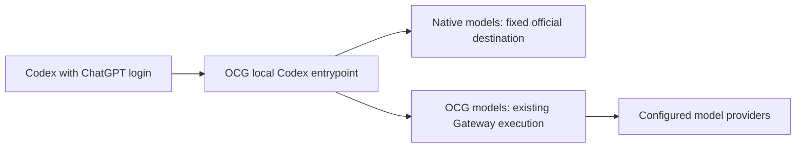

[简体中文](codex-integration-proposal.zh-CN.md)

# Codex integration research and implementation proposal

Status: researched and designed; not implemented or enabled. Research date: 2026-09-25.

The intended result is access to OCG models from Codex Desktop and CLI while retaining ChatGPT login, native models, and existing conversations. Preserving login means that integration neither replaces credentials nor switches authentication methods. Account revocation, native authentication expiry, and official outages remain subject to Codex's normal authentication behavior.

## What OpenCodex does

The highest-star matching repository was `lidge-jun/opencodex` (16,214 stars when checked). Source review is pinned to `87a78e5f26f81373bf57c39495037849bd7996f0`. The full OpenCodex application was not executed.

- Default local injection changes root `openai_base_url`, retaining the built-in `openai` provider identity. Existing conversations can resolve their original provider without rewriting history. [Injection plan](https://github.com/lidge-jun/opencodex/blob/87a78e5f26f81373bf57c39495037849bd7996f0/src/codex/inject/plan.ts#L203-L263)
- Independent admission credentials, explicit authless mode, or client compaction policy select a dedicated provider instead. Normal login mode retains `requires_openai_auth = true`; authless operation is a separate opt-in. [Configuration generation](https://github.com/lidge-jun/opencodex/blob/87a78e5f26f81373bf57c39495037849bd7996f0/src/codex/inject/config-toml.ts#L125-L150)
- The native OpenAI route forwards incoming login credentials only to the canonical official destination. Third-party routes use their own provider authentication. [Passthrough adapter](https://github.com/lidge-jun/opencodex/blob/87a78e5f26f81373bf57c39495037849bd7996f0/src/adapters/openai-responses/passthrough.ts#L194-L245)
- The catalog combines native and routed entries, handles name collisions, and can be selected through `model_catalog_json`. [Catalog construction](https://github.com/lidge-jun/opencodex/blob/87a78e5f26f81373bf57c39495037849bd7996f0/src/codex/catalog/build-entries.ts)

OpenCodex also manages account pools, OAuth refresh, and history migrations. This proposal adopts the routing, configuration ownership, and catalog projection ideas needed for the requested integration.

Official documentation supports overriding the built-in provider with `openai_base_url`. Custom providers cannot reuse the reserved `openai` name, and machine-level provider configuration cannot live in project `.codex/config.toml`. [Advanced configuration](https://learn.chatgpt.com/docs/config-file/config-advanced)

## Local observations

Installed Codex CLI `0.153.4` was exercised with three isolated `CODEX_HOME` directories, synthetic login credentials, and a local HTTP fixture. No real authentication file was read and no real model credential was used. Test-only `chatgpt_base_url` and proxy environment settings also redirected account requests locally; they are not proposed product settings.

| Configuration | Model request authentication | Login file and status |
| --- | --- | --- |
| Root `openai_base_url` | Synthetic ChatGPT bearer | File hash unchanged; still reports ChatGPT login |
| Dedicated provider, `requires_openai_auth=true` and `env_key` | Synthetic OCG bearer | Same |
| Dedicated provider, `requires_openai_auth=true` and custom `x-api-key` header | Synthetic ChatGPT bearer plus OCG Key | Same |

The root override requested `/v1/models?client_version=0.153.4`, attempted WebSocket GETs at `/v1/responses`, and fell back to POST with `Content-Encoding: zstd`. Dedicated providers did not advertise WebSockets and used ordinary HTTP POST.

All three configurations rendered the local fixture reply and exited with code 0. These observations establish separation of cached login and model transport for this CLI build. They do not prove long-term real-account refresh, Desktop UI behavior, third-party inference, or a complete tool loop.

The official authentication page still says `requires_openai_auth=true` ignores `env_key`; the installed CLI and current OpenCodex source show the opposite precedence. Record this as version-specific evidence and probe capabilities rather than assuming the same behavior on every build. [Authentication](https://learn.chatgpt.com/docs/auth#alternative-model-providers)

## Recommended design

Retain the `openai` identity by default and add a Codex-specific local entrypoint inside the existing OCG process. Ordinary `/v1` Gateway endpoints keep their existing OCG Key authentication.

### Configuration and login

The Host previews and manages root `openai_base_url` and an OCG-owned catalog path. It does not modify login caches, OS credentials, `chatgpt_base_url`, `forced_login_method`, history databases, or session files. Preserve the model default and let users select newly available models.

Bind a dedicated `127.0.0.1` listener and verify readiness before backing up and atomically updating configuration. Ask the user to restart or start a fresh task when needed: a successful configuration write does not establish that a running task switched routes. Restoration changes only fields whose current values still match OCG's ownership record, preserving subsequent user edits.

Roll back failed configuration, binding, or catalog writes. Normal disablement restores configuration first. After a crash, expose a clear connection error and recovery action instead of silently changing providers.

### Local access boundary

A root URL override cannot attach an independent OCG Key like a custom provider can. This mode therefore needs a separate local entrypoint bound to a user-selected, dedicated OCG Key with appropriate limits. Third-party execution uses that Key's existing permissions and metering.

This mode trusts local processes able to reach that port. Loopback binding, Host/Origin checks, and an endpoint allowlist restrict remote and browser access but cannot prove the caller is Codex. An arbitrary bearer token is not authentication. The enablement preview must disclose that local applications can use the bound Key. Do not publish this listener to LAN/Docker or weaken ordinary Gateway authentication.

For independently authenticated requests, offer a dedicated `ocg` provider retaining `requires_openai_auth=true` and separate OCG credentials. Validate Desktop environment inheritance and conversation restoration separately. Existing `openai` conversations remain native; this alternative must not be described as providing identical continuity.

### Two request paths

1. Native models are exact entries from the actual native catalog and use fixed official HTTPS destinations. Forward only required authentication headers, prohibit credential-bearing redirects, and neither retain nor independently refresh refresh tokens. Codex handles genuine native authentication failures.
2. OCG models have a stable client mapping such as `ocg/<public model name>`. Resolve the exact public name and reuse routing, quotas, logs, and conversion. Strip ChatGPT Authorization, account identifiers, and cookies before entering this branch; execute under the bound OCG Key identity.
3. Do not infer destinations from prefixes such as `gpt-`. Reject unknown names, collisions, and stale mappings; never fail over across credential domains. Report third-party authentication failures accurately without presenting them as ChatGPT logout or triggering its login refresh.

Retain native metadata and project OCG models visible to the chosen Key that pass Codex capability validation. Scope native catalogs and cached entitlement conclusions to the account. Preserve native model instructions and capabilities; use evidence-backed tool, image, context, and reasoning settings for third-party entries rather than copying all native capabilities.

### Protocol adaptation

Existing foundations are `crates/ocg-core/src/gateway/mod.rs`, `handler.rs`, and `crates/ocg-gateway/src/protocol.rs`: Responses, Chat Completions, Messages conversion, and custom/namespace tool mapping. OCG currently requires `store=false`, rejects `previous_response_id` and `conversation`, and does not support some grammar tools.

The Codex entrypoint must handle observed zstd requests with a decompressed-size bound. Establish correct WebSocket negotiation or reliable HTTP fallback, rather than hiding a missing feature behind repeated connection failures. Preserve required native semantics and validate third-party conversion through actual Codex tool calls.

`/responses/compact` and long-conversation restoration are required. Native requests may pass through; third-party conversations need compatible third-party compaction or verified client compaction, never an undisclosed transfer to an official model. First establish whether the client supplies complete history; add minimal continuation state only if runtime evidence requires it. Never silently discard continuation IDs, tool results, or encrypted reasoning/compaction items. Require a fresh task explicitly when cross-model continuation cannot preserve their meaning.

## Implementation order and acceptance

1. Build an isolated acceptance harness for the CLI and Desktop runtimes actually used: login state, account endpoints, catalog, SSE, WebSocket, compression, tool loops, cancellation, and restoration.
2. Implement the local listener and credential-isolated branches in the existing Host. Reuse the Gateway; no separate daemon, account store, or general plugin framework is required.
3. Add **Applications > Codex** with detection, a change preview, Key selection, enablement, catalog refresh, and restoration. Follow V4 CAS, Host fingerprints, and Pinia ownership. Update schema, generated types, and paired user guides.
4. Enable the feature only after native and at least one OCG model complete multi-turn tool use, and real login, existing conversations, restart, compaction, and removal pass acceptance. Local capture endpoints must prove that third parties never receive ChatGPT credentials and their 401/429 failures do not affect official login.

This delivery contains research and an implementation proposal. It does not change user Codex configuration, install OpenCodex, or route the current task through OCG. Real Desktop and provider acceptance remain implementation work. Show the final global configuration changes and obtain authorization before enabling them.
