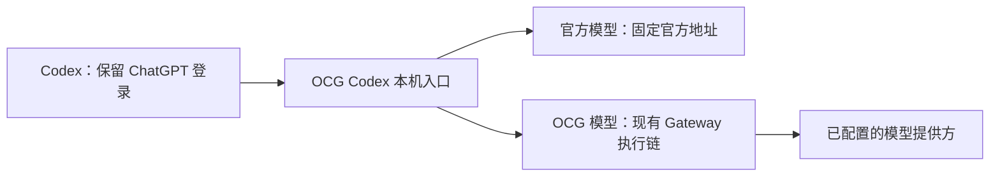

[English](codex-integration-proposal.md)

# Codex 接入研究与实施方案

状态：研究与设计，尚未实现或启用。调研日期：2026-09-25。

目标是在 Codex Desktop 与 CLI 中使用 OCG 模型，保留 ChatGPT 登录、官方模型入口和已有会话。这里的“不掉登录”是接入操作不替换登录凭据、不切换登录方式；账号撤销、原生登录过期或官方故障仍由 Codex 的正常登录流程处理。

## OpenCodex 的做法

按 GitHub Star 数选择 `lidge-jun/opencodex`（调研时 16,214 Star）。源码固定在 `87a78e5f26f81373bf57c39495037849bd7996f0`，以下结论来自源码阅读，不代表运行过完整 OpenCodex。

- 默认本机模式修改根配置 `openai_base_url`，保留内置 `openai` Provider 身份。旧会话仍能找到原来的 Provider，不必改写历史。[注入计划](https://github.com/lidge-jun/opencodex/blob/87a78e5f26f81373bf57c39495037849bd7996f0/src/codex/inject/plan.ts#L203-L263)
- 需要独立访问凭据、免登录模式或客户端压缩策略时，改用独立 Provider。正常登录模式保留 `requires_openai_auth = true`，免登录是另外的显式选项。[配置生成](https://github.com/lidge-jun/opencodex/blob/87a78e5f26f81373bf57c39495037849bd7996f0/src/codex/inject/config-toml.ts#L125-L150)
- 原生 OpenAI 路由只向固定官方目标转交请求中的登录凭据；第三方模型使用各自的提供方鉴权。[转发适配器](https://github.com/lidge-jun/opencodex/blob/87a78e5f26f81373bf57c39495037849bd7996f0/src/adapters/openai-responses/passthrough.ts#L194-L245)
- 模型目录合并官方条目与代理条目，并处理名称冲突；注入配置可以指向 `model_catalog_json`。[目录构造](https://github.com/lidge-jun/opencodex/blob/87a78e5f26f81373bf57c39495037849bd7996f0/src/codex/catalog/build-entries.ts)

OpenCodex 还有账号池、OAuth 刷新、历史迁移等功能。本方案只借鉴与当前目标有关的请求分流、配置所有权和目录投影。

官方文档确认 `openai_base_url` 可以重定向内置 Provider；自定义 Provider 不能重用保留的 `openai` 名称，机器级 Provider 配置也不能放进项目 `.codex/config.toml`。[高级配置](https://learn.chatgpt.com/docs/config-file/config-advanced)

## 本机验证

用本机 Codex CLI `0.153.4`、三个独立 `CODEX_HOME`、合成登录凭据和本地 HTTP 服务检查请求。测试没有读取真实 `auth.json`，没有使用真实模型凭据；测试用 `chatgpt_base_url` 和代理环境把账号请求也导向本地，它们不属于产品配置。

| 配置 | 模型请求鉴权 | 登录文件及状态 |
| --- | --- | --- |
| 根 `openai_base_url` | 合成 ChatGPT Bearer | 文件哈希不变，仍报告 ChatGPT 登录 |
| 独立 Provider，`requires_openai_auth=true` + `env_key` | 合成 OCG Bearer | 同上 |
| 独立 Provider，`requires_openai_auth=true` + `x-api-key` 自定义请求头 | 合成 ChatGPT Bearer + OCG Key | 同上 |

根覆盖模式先请求 `/v1/models?client_version=0.153.4`，尝试 WebSocket `GET /v1/responses`，然后回退到带 `Content-Encoding: zstd` 的 POST。两个独立 Provider 未声明 WebSocket，观察到普通 HTTP POST。

三种配置均成功接收并显示本地服务的模拟回复，退出码为 0。这验证了登录状态与模型传输可以分离，以及本机 CLI 的请求形态。它不证明真实账号的长期刷新、Desktop UI、第三方推理或完整工具循环。

官方认证文档仍写着 `requires_openai_auth=true` 会忽略 `env_key`，而本机实测及 OpenCodex 当前源码显示相反结果。按实测版本记录差异，安装器做能力探测，不能把这一优先级推广到所有 Codex 版本。[认证文档](https://learn.chatgpt.com/docs/auth#alternative-model-providers)

## 推荐设计

推荐默认保留 `openai` 身份，在 OCG 现有进程中增加 Codex 专用本机接入。普通 `/v1` Gateway 继续要求有效 OCG Key。

### 配置与登录

Host 预览并管理根 `openai_base_url` 和 OCG 自有模型目录路径。登录缓存、系统凭据库、`chatgpt_base_url`、`forced_login_method`、历史数据库和会话文件均不由安装器修改。保留原有模型默认值，新增模型由用户选择。

先绑定专用 `127.0.0.1` 监听并验证就绪，再备份及原子更新配置。启用后提示重启或新建任务；不能把配置写入成功描述成正在运行的任务已经切换。恢复只修改仍与安装记录一致的 OCG 自有字段，保护安装后用户的新修改。

配置不可用、监听失败、目录写入失败都应回滚。正常停用先恢复配置；崩溃后保持明确的连接错误和恢复入口，不悄悄改投其他提供方。

### 本机访问边界

根地址覆盖无法像独立 Provider 那样附加一个 OCG Key。因此默认接入需要单独的本机入口，绑定一把用户选择的专用、有限额 OCG Key，在第三方执行分支中按该 Key 的现有权限与计费规则处理。

此模式信任能访问该本机端口的本地进程。Loopback、Host/Origin 校验和端点白名单能限制远程及浏览器入口，但不能证明调用者是 Codex，也不能把“有一个 Bearer”当成认证成功。启用页必须说明本机程序可使用这把绑定 Key；此监听不对 LAN/Docker 发布，不修改普通 Gateway 的 Key 校验。

若用户要求每个请求独立鉴权，可选择独立 `ocg` Provider，并保留 `requires_openai_auth=true`、使用独立 OCG 凭据。此选项要单独验证 Desktop 环境变量继承及会话恢复；旧的 `openai` 会话仍走原生 Provider，不能宣称两种模式体验完全一致。

### 两条请求路径

1. 官方模型来自实际原生目录的精确条目，固定转发至官方 HTTPS 地址。只转发必要认证头，禁止重定向携带凭据，不保存或主动刷新 refresh token。必要的原生 401 由 Codex 正常处理。
2. OCG 模型使用稳定的 `ocg/<公开模型名称>` 客户端映射，解出精确公开名称后复用现有路由、配额、日志及协议转换。进入执行链前清除 ChatGPT Authorization、账户标识和 Cookie；使用绑定 OCG Key 的身份。
3. 不以 `gpt-` 等前缀猜测去向。未知名称、冲突和失效映射明确报错；不得在两条路径间自动降级。第三方鉴权故障保留真实原因，但不能误报为 ChatGPT 登录失效或触发其登录刷新。

目录沿用原生模型元数据，再投影该 Key 可访问且通过 Codex 能力验证的 OCG 模型。官方目录与缓存按账号隔离，账号切换不能复用他人的权限结论。保留原生模型指令和能力，只给第三方条目填写有证据的工具、图片、上下文和推理参数；不要把原生模型能力整套复制给第三方。

### 协议适配

现有基础在 `crates/ocg-core/src/gateway/mod.rs`、`handler.rs` 与 `crates/ocg-gateway/src/protocol.rs`：已有 Responses、Chat Completions、Messages 转换和 custom/namespace 工具映射。OCG 当前要求 `store=false`，拒绝 `previous_response_id` 与 `conversation`，某些 grammar 工具也不支持。

Codex 入口需要处理实测出现的 zstd 请求，限制解压后的体积。还需要验证 WebSocket 的正确协商或可靠 HTTP 回退，不能靠多次连接失败掩盖缺失能力。官方原生路径保留必要协议语义；第三方使用现有转换，但必须通过实际 Codex 工具调用验收。

`/responses/compact` 和长对话恢复属于必需能力。官方分支可透传，第三方必须使用其兼容压缩或经验证的客户端压缩，不能把第三方会话偷偷交给官方模型。先确认客户端是否发送完整历史；只有实测证明需要服务器续接，才增加最小会话状态。不静默丢弃 `previous_response_id`、工具结果或 encrypted reasoning/compaction 项；无法安全跨模型继续时明确要求新建任务。

## 实施顺序与完成标准

1. 增加隔离 Codex 验收工具，覆盖 CLI 和 Desktop 实际使用的运行时：登录前后状态、账号接口、模型目录、SSE、WebSocket、压缩、工具循环、取消和恢复。
2. 在现有 Host 中完成专用本机监听与两条严格隔离的请求路径；复用 Gateway，不新增独立守护进程、账号仓库或通用插件框架。
3. 增加 **应用 > Codex**：检测、变更预览、Key 选择、启用、刷新目录、恢复原配置。沿用 V4 CAS、Host 指纹、Pinia 状态所有权。配套更新 schema、生成类型及中英文用户指南。
4. 完整验证后开放启用：原生模型与至少一个 OCG 模型均完成多轮工具调用；真实登录状态、旧会话恢复、重启、压缩与移除都通过。用本地捕获端点证明第三方永远收不到 ChatGPT 凭据；第三方 401/429 不影响官方登录。

本次交付为研究及实施方案。没有修改用户 Codex 配置、安装 OpenCodex 或把当前任务切换到 OCG。真实 Desktop 与第三方服务验收仍属于实施阶段，启用真实全局配置前需要展示最终变更并取得授权。
